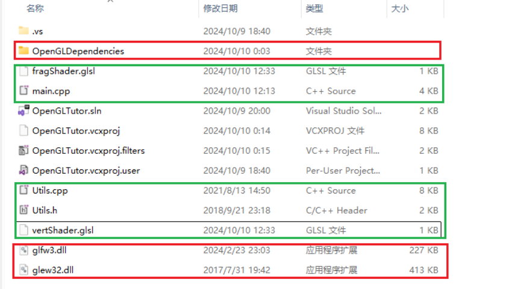

## 介绍

本仓库是东南大学计算机图形学课程的课程实验，伴随课程进行的全流程OpenGL代码实践。

## 实验内容

* 在第1次实验中，我们学习了OpenGL编程的基本规范，完成了一个简单的二维卡通图像。
* 在第2次实验中，我们进入三维的世界，因此我们重新搭建，通过导入模型和自己定义三维图形的顶点坐标，展示了一个鸡块和棒棒糖的组合画面，并让它们旋转平移动了起来。
* 在第3次实验中，我们学习了阴影和明暗。因此在第2次实验的基础上，我们添加了光源，通过光源和光照函数的实现，我们的模型上有了明暗变化。
* 在第4次实验中，我们给模型加上了纹理，通过在片元着色器中混合纹理颜色和光照颜色，实现了纹理和光照的结合，模型和背景也更加生动。
* 在最终的综合实验中，我们给画面加上了天空盒，并实现了场景漫游。用天空盒替换原来的黑色背景增添了场景的真实感，简单的第一人称场景漫游也给画面加上了一些交互要素。

## 目录结构

* 实践环境配置：包含一个OpenGL项目模板需求文件和实验环境配置手册。
* 实验一 至 五：包含该实验中的源代码和简单的介绍PPT。

## 环境配置

参考实验环境配置手册

1. 使用 Visual Studio 新建一个项目
2. 将OpenGLtemplate文件夹中的文件复制到项目路径中（即图中红色框中所示）
3. 将OpenGL1~5文件夹中的文件全部复制到项目路径中（即图中绿色框中所示）

   
4. 参考实验环境配置手册配置在 Visual Studio 设置中配置项目的环境变量和依赖项
